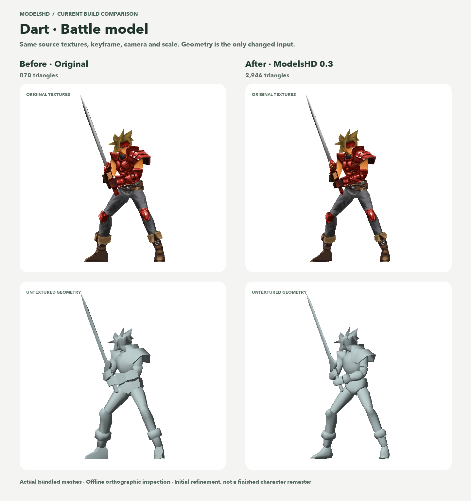
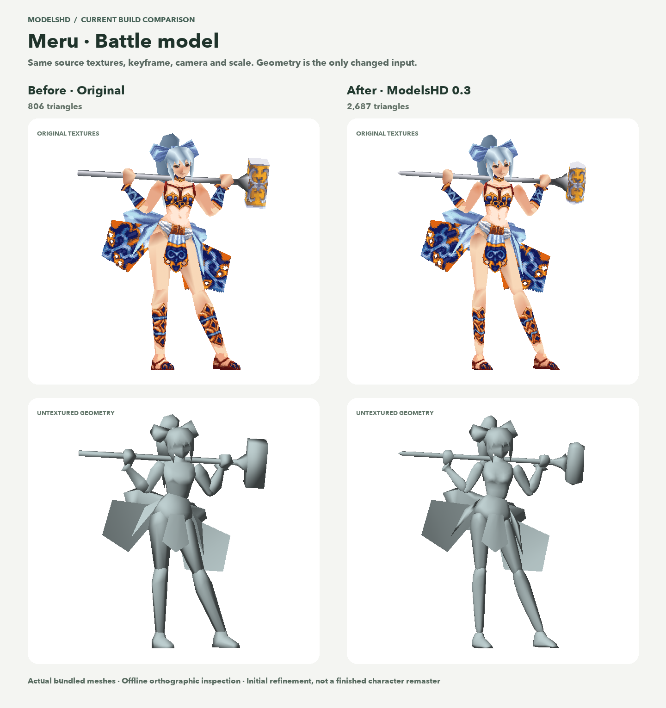

# Legend of Dragoon: Definitive

## [⬇ Download the Steam Deck installer](https://github.com/gideonidoru/legend-of-dragoon-definitive/releases/latest/download/Install-Definitive.desktop)

**Start here in Steam Deck Desktop Mode.** The guided installer downloads the engine, Java, bundled HD mods and enhanced cinematics, then prepares your own game discs  . No separate model transfer or asset-generation setup is needed.

[Release notes](https://github.com/gideonidoru/legend-of-dragoon-definitive/releases/latest) · [Portable installer ZIP](https://github.com/gideonidoru/legend-of-dragoon-definitive/releases/latest/download/Definitive-Installer.zip) · [Installation and recovery help](docs/definitive/INSTALLER.md)

<a href="https://ko-fi.com/gideonidoru"></a>

If you're enjoying Definitive, you can [buy me a coffee](https://ko-fi.com/gideonidoru) to support the project.

Definitive is a Steam Deck-first modernization of *The Legend of Dragoon*, built on [Severed Chains](https://github.com/Legend-of-Dragoon-Modding/Severed-Chains). We want the game to feel as good to return to today as it did the first time: familiar characters and painted environments, clearer visuals, comfortable controls, and an installation you can get through without assembling a collection of tools and mods yourself.

**This is an unofficial community alpha.** The installer and launcher have been confirmed working on a physical Steam Deck. The newer models, cinematics and rendering changes still need device testing; the complete visual remaster is in progress.

## Install and play

1. Switch your Steam Deck to **Desktop Mode** and download the installer above. Use a fresh copy if you tried an earlier release; older shortcuts can point to older builds.
2. Open `Install-Definitive.desktop` in **Dolphin**. Allow execution if KDE asks.
3. Choose your installation folder and supply your **four US game-disc images**, or reuse discs from an existing installation. BIN/raw ISO files and ZIP, RAR or 7z containers are supported.
4. Let setup download and prepare the game. Add the optional Steam library shortcut, then launch from Steam or select **Play** in the Definitive launcher.

The default folder is `/home/deck/Games/Legend-of-Dragoon-Definitive`; custom and SD-card locations are supported. The initial download is a small shortcut. Setup then downloads the roughly 13 MB installer interface, Java and a **roughly 1.7 GB game package**, in addition to preparing your discs. Game discs are not included, and your source images stay untouched.

The launcher checks for updates and can restore a previous local version. **Repair** verifies managed files and downloads only missing or changed files, preserving prepared game data. **Update** reuses matching verified files and retrieves the changes. **Reinstall** downloads the full application and prepares a fresh workspace while retaining saves, settings, custom mods and imported discs. **Uninstall** removes ISOs only if you explicitly choose that option.

Setup shows overall progress and current-file progress. Downloads and activation are checked against the release inventory, with interruption recovery and protection against maintenance while the game is running. Only the current release is kept on GitHub, so use the download button above rather than an older shortcut. Local Restore versions and personal data are retained. [Installation and recovery help](https://github.com/gideonidoru/legend-of-dragoon-definitive/blob/codex/delivery-hardening/docs/definitive/INSTALLER.md).


*Linux launcher preview. This image shows the interface; it is not a Steam Deck gameplay capture.*

## What we're aiming for

The visual goal is a polished modern AA game with a deliberate retro aesthetic. That means keeping the original compositions, silhouettes, costumes and atmosphere while improving the things that stand out on a modern screen: angular faces, blocky limbs, uneven material detail, jagged edges and low-resolution cinematics.

There are several parts to making that work together:

- **A consistent world.** Build around Skurfa's HD backgrounds, then fill missing environments, battle panoramas, world-map artwork and props. Keep foreground masks and scene placement correct so characters still walk behind the right trees, walls and doors.
- **Recognizable, better-shaped characters.** Refine the broad model roster efficiently, then give faces, hands, hair, costumes and awkward joints the individual attention they need. Preserve the original animations and transformations.
- **Lighting that belongs to the scene.** Give models smoother shading, restrained material highlights, soft contact shadows and light from luminous effects, while respecting the painted backgrounds' own lighting.
- **Clear handheld presentation.** Keep dialogue, menus and timing prompts crisp. Improve the surrounding image without obscuring the cues needed for Additions.
- **An easy return to the game.** Put installation, updates, recovery and controller-friendly navigation in one place. Keep convenience settings and visual choices independent.
- **Quality that holds up on Deck.** Choose defaults through comparisons in motion and measurements of frame times, memory, loading and power. A successful build is only one part of that evidence.

Our approach is incremental: reuse good community work, add separate mods, and extend the engine where those mods need a small shared feature. Skurfa's existing art stays intact. The next model priorities are party field/story models, prominent NPCs, bosses and dragons, then common enemy families and remaining visible props. [Visual direction](docs/definitive/CHARACTER_REMASTER.md) · [Model roadmap](docs/definitive/MODELS_HD_ROADMAP.md) · [Project plan](docs/definitive/PROJECT_PLAN.md).

## ModelsHD: the broad first pass

ModelsHD 0.4 inspects all **1,343 supported canonical model containers**. **964 receive some smoothing; 379 keep their originals** because their topology is unsafe or refinement adds no useful detail. The complete mod bundles **8,531 unique custom part replacements**, including the nine confirmed party field models and all 19 party battle forms, with eligible NPCs, bosses, enemies, scenery and world-map resources. Original animation/script data and active texture addressing remain intact.

This is a modest first geometry pass. Individual faces, hair, hands and costumes still need deliberate reconstruction. [Build and use ModelsHD](integrations/modelshd/README.md) · [Exact coverage and verification](docs/definitive/MODELS_HD_WORLD_PASS.md) · [Model catalog](docs/definitive/MODEL_CATALOG.md).

## Before and after

These comparisons document the **earlier ModelsHD 0.3 party battle pass**. Version 0.4 uses a more conservative crease threshold across the full supported catalog; these images do not preview that new recipe. Both sides use the same textures, pose, camera, scale and lighting, so the visible change comes from geometry. The lower panels remove textures to make the smoother surfaces easier to see.

### Dart



Dart's battle mesh goes from **870 to 2,946 triangles**. The first pass rounds eligible surfaces while retaining the recognizable armor, sword and silhouette.

### Meru



Meru's battle mesh goes from **806 to 2,687 triangles**. The untextured view makes the changes to limbs and clothing more apparent than the original textures do.

**These are offline model previews, not gameplay screenshots.** They document the published 0.3 pass, rather than the newer 0.4 world pass or experimental Dart remodeling. This is a modest first refinement, not the finished character remaster. Clearer faces, better hands, stronger costume shapes and natural joints still need deliberate remodeling. [Comparison notes](docs/definitive/images/comparisons/README.md).

## Mods and artwork

The current **all-HD installation and repair** release bundles **Skurfa, ModelsHD, FMVHD, EnvHD, CharHD, UIHD and FxHD**. Bundling a module does not mean all of its artwork is complete. The table distinguishes the published payload from newer production work. Each module has its own identity; use the game's mod manager for individual choices. The launcher's original/HD artwork preference also controls managed Skurfa and ModelsHD selection.

| Mod | What it contributes | Current coverage |
| --- | --- | --- |
| **[Skurfa's HDR Backgrounds](https://github.com/IntiArtHub/skurfas-upscaled-hdr-backgrounds)** | Individually remastered field backgrounds and foreground layers; the foundation for our environment style. | Bundled pinned v1.1.0 integration: 38 distinct scene packs, with aliases reusing existing artwork. This is selected scene coverage, not every field in the game. |
| **[ModelsHD](integrations/modelshd/README.md)** | Custom geometry that retains original animation parts and active texture/material bindings. | Bundled v0.3: all 19 party battle forms—nine normal, nine Dragoon and Divine Dart. Field and world-map replacements remain unfinished. |
| **[FMVHD](integrations/fmvhd/README.md)** | Preprocessed, enhanced cinematics with streamed playback and original-video fallback. | Bundled: all 18 films at 1280×768, original 15 fps cadence and 5:3 proportions. No generated motion frames. |
| **EnvHD** | Missing environment art: battle skies and surfaces, world-map scenery, field scenes and props. | Published pilot: two battle stages and two panoramas. The newer branch packages 70 distinct restored panoramas through 73 source bindings, and selects 38 location landscapes and one parchment world-map backdrop. Native scene acceptance remains pending, and Skurfa-owned art stays protected. |
| **CharHD** | Character texture replacements, coordinated with ModelsHD's geometry and material identities. | Bundled adapter; no new character-art payload in the published release. The production branch now has 4× candidates for all 19 playable forms, with ModelsHD on/off compatibility probes. Character art review and runtime integration remain in progress. It is separate from ModelsHD. |
| **UIHD** | Interface artwork, icons and later portrait/lettering work. | Published pilot: five item icons. The production batch expands to 64 selected PNGs, including all 21 goods icons, element symbols, command frames, checkboxes and menu/dialogue artwork. Palette variants are not extra screens; full HUD and portrait work remain open. |
| **FxHD** | Effect textures and particles, with their original transparency and animation behavior preserved. | Published pilot: field dust. The newer branch integrates dust, two footprints, two smoke textures and save-point glow, using about 80 KiB of texture data before driver overhead. Live palette/source changes retain the original drawing route; broader spell/transformation work remains ahead. |

HD assets are prepared ahead of time; the Deck does not need to run the authoring tools or neural models. Custom meshes and artwork are public project deliverables, with only selected runtime assets entering the installed mods. Development candidates retain their review status.

FMVHD preserves the source timing and soundtrack content, with bounded buffering, source/checksum checks and fallback when a compatible replacement is unavailable. Its restoration can soften some detail; it is not a recovery of the original studio masters. Existing campaigns use the game's normal mod-selection prompt to enable newly installed mods. [FMV checks and remaining device tests](docs/definitive/FMVHD_VALIDATION.md).

## Engine and presentation improvements

Severed Chains supplies the game port, rendering and audio foundations, input support, disc extraction and modding API. Definitive builds on those systems. The engine on **main** now includes the following improvements. The consolidated installer is being built to bring the newer changes together with the published repair system:

- **SMAA anti-aliasing:** cleaner silhouettes and diagonal edges through three spatial passes, with dialogue, menus, battle HUD and Addition prompts protected. It uses the original MIT-licensed [SMAA implementation](gfx/shaders/smaa/README.md), with the earlier edge filter available as fallback.
- **Smoother lighting and soft contact shadows** across field maps, battles, the world map and model-based cutscenes, retaining the scene's original light directions and colors.
- **Richer material support:** individual faces can carry surface types and roughness, while compatible HD assets can supply normal and roughness maps. Cloth, skin, leather and metal can respond differently; artists still need to author meaningful material assignments.
- **Artwork-matched lighting support:** environment packs can describe their light direction, color and ambient tone so models fit the painted scene. Profiles reset with scene changes rather than leaking into the next location.
- **Colored effect lights:** up to four nearby emitters from luminous effects and save points illuminate supported opaque geometry. Selective bloom gives luminous effects a soft glow independently of CRT styling.
- **HD texture filtering and gentle sharpening:** mipmaps and capability-checked anisotropic filtering improve eligible HD images. Atlas padding, original palettes and transparency remain part of the compatibility contract.
- **Bounded artwork caching:** repeated PNG loads reuse decoded pixels within a 64 MiB retained cache. Prewarming hooks let artwork mods prepare images before display, and loading measurements help identify remaining stalls.
- **Safer graphics handling:** failed shader reloads retain the working program, texture uploads and mipmap updates use the correct bindings, and deleted texture IDs no longer leave stale cached bindings.
- **Enhanced cinematic playback:** bounded streaming, cancellation and synchronization retain the original timing and return-to-game behavior.

### Default assets: detail, lighting and first visits

These additions are also merged into **main**, ready for the consolidated release:

- **Default surface detail** adds a subtle shared normal/roughness finish to supported original and HD models. Original palette animation and transparency stay live, and authored maps take precedence. This is a conservative baseline, not hand-painted skin, fabric or metal masks for every asset.
- **Automatic scene-lighting profiles** follow the game's original lights and scripted changes when an artist profile is absent. They preserve the original lighting as the dominant input; they do not infer lighting from background images.
- **First-visit preparation** moves native field-background decoding onto a bounded CPU worker during loading. The 43 bundled Skurfa scene mappings also receive preload hints, prioritizing images that fit the cache. Failed or oversized preparation retains the original loading route.

These features use the existing **Graphics** settings, with restrained defaults and individual controls. SMAA and the other screen effects use no temporal accumulation, generated frames or extra input buffering. Local GPU and loading probes pass, but physical Deck frame times, memory use and battery impact remain to be measured. [Rendering details and verification](docs/definitive/RENDERING_LIGHTING.md).

### Faithful audio

The merged audio improvements preserve decoded prerecorded XA clips as PCM WAV, avoiding the extra lossy conversion used previously. Playback queues only valid decoded samples, lets clip endings finish, and maintains more accurate timing during underflow or device recovery.

The original score, voices, effects, volume behavior and music settings remain intact. The combined installer will refresh older recordings locally from installed discs; there is no replacement soundtrack download. All **41 recordings** in the tested US set decoded successfully, adding about **156 MiB** to local game data. Physical Deck listening, Bluetooth/device switching and suspend/resume checks remain open. [Audio validation](docs/definitive/AUDIO_VALIDATION.md).

## Gameplay comfort, on your terms

Choose **Definitive** or **Faithful** when creating a campaign. Definitive enables conveniences such as saving anywhere, battle autosaves, running by default, faster text, shorter transitions, enemy HP bars and turn-order information. Faithful selects retail-oriented settings. Both keep normal Additions and their ordinary timing windows, default to 1× rewards, and omit difficulty overhauls.

Artwork, rendering, audio and controller settings remain independent of the campaign preset. Faithful is a settings profile rather than a claim of bit-perfect retail emulation. Changing a preset later cannot undo progression already earned. [Full preset comparison](docs/definitive/PRESETS.md).

The current installer includes binding-aware **Equip, Sort, Unequip and Back** equipment hints inspired by [Quality of Life+](https://github.com/FrancisDionne/Severed-Chains/releases/tag/experimental).

The broader [native-settings implementation](docs/definitive/QOL_SETTINGS.md) is now merged into main for the consolidated installer:

- **Inventory and shops:** contextual hints follow remapped bindings; equipment can be filtered and sorted; quantity buying/selling respects affordability, capacity and protected items.
- **Campaign rewards:** independent enemy XP and gold multipliers range from 0× to 10×, defaulting to **1×**. A battle keeps the values it started with, and item drops retain their existing rules.
- **Addition timing feedback:** optional Early, Late, Wrong Button, Good and Perfect hints, **off by default**. Feedback observes the existing hit result without changing timing windows, damage or mastery.

These are features in the existing settings, with no separate mod to manage. Both campaign presets retain 1× rewards and feedback off. The reward-control implementation is independently authored around current APIs, inspired by Battle Rewards; its older mod is not bundled. **Dragoon Modifier** remains an unbundled overhaul candidate. [Community integration notes](docs/definitive/INTEGRATION_ALPHA.md).

## Where development stands

**October 10, 2026:** the current public release delivers all seven HD modules with selective Repair/Update and hardened installation recovery. Its payload still includes ModelsHD 0.3 and the early artwork pilots. The installer workstream has combined the newer engine, audio, ModelsHD 0.4 and native QoL settings and is validating the Linux and macOS packages. Reviewed artwork increments are being coordinated against that same baseline. Separate model-release publication is held so there is **one consolidated download**.

| Workstream | Latest completed work | Integration and delivery |
| --- | --- | --- |
| **Rendering and audio** | SMAA, per-face material/roughness support, default surface detail, live lighting profiles, bounded artwork caching/preparation and faithful XA playback. | Merged into main; newer increments await the consolidated installer. |
| **[ModelsHD 0.4](integrations/modelshd/README.md)** | 964 of 1,343 cataloged containers receive refinement, including nine confirmed party field models and all 19 battle forms. 8,531 unique custom parts; 379 containers retain originals under the safeguards. | Merged into main. The current public installer remains on 0.3 until the combined release. This is broad smoothing, not 964 bespoke character rebuilds. |
| **[EnvHD](https://github.com/gideonidoru/legend-of-dragoon-definitive/pull/1)** | 70 battle-panorama restorations through 73 source bindings, plus 38 location landscapes and one parchment world-map backdrop. Static terrain/scenery production is next; animated ocean surfaces stay separate. | Selected development baselines are packaged on the artwork branch. Native scene acceptance and broader environment coverage remain open. |
| **CharHD** | 4× texture candidates for all 19 playable forms; 38 headless mesh combinations checked with ModelsHD enabled and disabled. Native animation/deformation fallback is retained. | Runtime integration and visual selection continue. Batch restoration alone remains too subtle for the final target; focused armor/material reconstruction is underway. |
| **UIHD** | 64 selected PNGs: goods icons, element symbols, command frames, checkboxes and selected menu/dialogue artwork. Shared caching and protected-UI paths preserve lettering, clipping, transparency and live palettes. | Combined-engine compatibility and mod-reload checks are underway. Full HUD/portrait coverage and physical Deck readability remain open. |
| **FxHD** | Six selected 2× field textures: dust, two footprints, white smoke, brown smoke cloud and save-point glow. Shared caching/prewarming retains emission, effect lighting and reduced-flashing behavior. | Source/mask checks and reviews pass; build locks and single-version packaging are being finalized for the combined installer. |
| **[Native QoL settings](docs/definitive/QOL_SETTINGS.md)** | Equipment filters/sorting, quantity transactions, campaign XP/gold controls and optional Addition feedback. | Merged into main; awaiting combined installer delivery and physical controller checks. |
| **[Installation and repair](https://github.com/gideonidoru/legend-of-dragoon-definitive/pull/2)** | All-HD packaging, selective transfers, full Reinstall, durable interruption recovery, game-lifetime locks and CI-bound publication checks. | Public and verified; this delivery foundation is being combined with the newer main changes. |

The download button uses GitHub's **latest public release**, so it follows the replacement once that combined build is verified and published. Drafts are not downloads. A separate Dart geometry/CharHD experiment is held outside main and releases until explicitly accepted. Builds, loader tests, controlled GPU checks and package inventories provide development evidence; physical Deck acceptance remains separate.

The next proof is combined gameplay on the hardware: representative HD scenes, model transformations, foreground masking, busy effects, cinematic audio/skip/return behavior, controller reconnect, suspend/resume, and update/restore. A four-disc playthrough and measured Deck performance are still outstanding. We haven't reached the final AA visual target.

The [model catalog](docs/definitive/MODEL_CATALOG.md) provides loading contexts, identity evidence and component-reuse leads for expansion beyond the first battle roster. Its container counts include variants, scenery and other resources; they are not distinct-character counts. [Deck test plan](docs/definitive/DECK_TEST_PLAN.md) · [Validation records](docs/definitive/VALIDATION.md).

## Build from source

Players should use the **[Steam Deck installer](https://github.com/gideonidoru/legend-of-dragoon-definitive/releases/latest/download/Install-Definitive.desktop)**. For development, install **JDK 25** and use the checked-in **Gradle 9.1.0 wrapper**. Compilation requires no game discs.

```sh
git clone --recurse-submodules https://github.com/gideonidoru/legend-of-dragoon-definitive.git
cd legend-of-dragoon-definitive
./gradlew --no-daemon --console=plain clean build
```

To package the Linux x64 / Steam Deck target:

```sh
./gradlew --no-daemon --console=plain clean build definitivePackage portableInstaller -Pos=linux -Parch=x86_64 -Psteamdeck=true
```

For an existing checkout, initialize integrations with `git submodule update --init --recursive`. Ordinary builds never launch the game. [Setup and build instructions](docs/definitive/SETUP.md) · [Test controls](docs/definitive/BUILD_CONTROLS.md).

## Credits, contributions and licensing

Definitive depends on the work of the **Severed Chains maintainers and Legend of Dragoon Modding community**, and on creators such as **Skurfa** and **Quality of Life+**. We preserve upstream Git history, [credits](CREDITS), [source notices](credits.txt) and the unchanged [AGPL v3 engine license](LICENSE). Mods and artwork retain their own notices; the engine license does not confer rights to the original game's assets. This project is not affiliated with or endorsed by Sony or the original rights holders.

Contributions should explain the player benefit, existing upstream/mod overlap, compatibility and validation. Small modules with clear ownership make it easier to keep incorporating upstream improvements. [Upstream strategy](docs/definitive/UPSTREAM.md) · [Architecture](docs/definitive/ARCHITECTURE.md) · [Backlog](docs/definitive/BACKLOG.md).

Custom Definitive mod code, ModelsHD meshes and HD artwork upgrades are public and versioned, and intended for the normal downloadable installation. FMVHD's enhanced footage is published under the documented project policy exception; its derived footage remains distinct from the code license. **Game discs, full original extraction, saves, credentials, private diagnostics and local runtimes are not included.** [Asset policy](docs/definitive/ASSET_POLICY.md) · [FMVHD provenance and notices](integrations/fmvhd/README.md) · [Original upstream README](docs/upstream/README.md).
