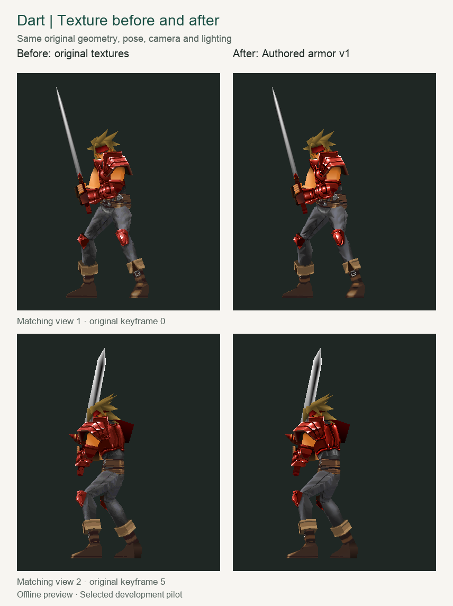
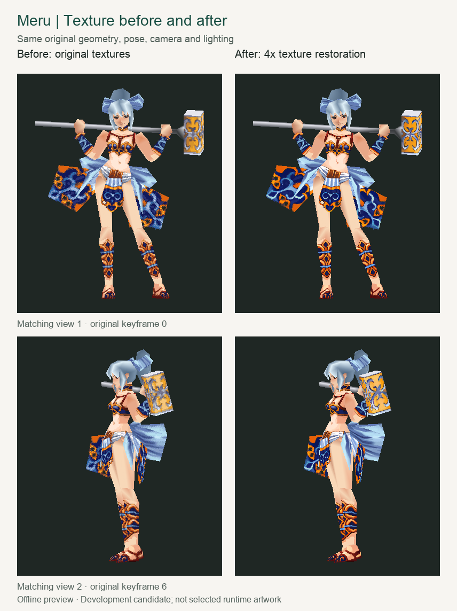

# Legend of Dragoon: Definitive

**A classic RPG. A new home on Steam Deck.**

## [⬇ Download the Steam Deck installer](https://github.com/gideonidoru/legend-of-dragoon-definitive/releases/latest/download/Install-Definitive.desktop)

HD artwork. Smoother models. Enhanced cinematics. One guided installation.

[Release notes](https://github.com/gideonidoru/legend-of-dragoon-definitive/releases/latest) · [Portable installer ZIP](https://github.com/gideonidoru/legend-of-dragoon-definitive/releases/latest/download/Definitive-Installer.zip) · [Installation help](docs/definitive/INSTALLER.md)

[Support Definitive on Ko-fi](https://ko-fi.com/gideonidoru).

**Legend of Dragoon: Definitive** is a Steam Deck-focused edition of *The Legend of Dragoon*, combining a native game port with curated HD mods, enhanced rendering and optional gameplay conveniences. Bring your four US game-disc images; the installer handles the engine, Java, mods and game preparation.

Built on [Severed Chains](https://github.com/Legend-of-Dragoon-Modding/Severed-Chains), Definitive adds an integrated presentation and installation experience: custom model and texture upgrades, restored interface and effect artwork, enhanced films, lighting improvements, campaign presets, and a launcher for updates and recovery. The story, recognizable character designs, original music and Addition-based combat remain central to the experience.

> **Alpha availability:** The current download contains the all-HD repair release. This feature tour also includes upcoming installer additions: broader model smoothing, Dart’s reconstructed head and hair, full UIHD and FxHD artwork, SMAA, independent engine clocks, audio and playback fixes, and expanded convenience settings. The remaster is unfinished, and Steam Deck gameplay/performance testing is ongoing. [See what your download includes](https://github.com/gideonidoru/legend-of-dragoon-definitive/releases/latest).

## More detail. The same unmistakable world.

### Characters with smoother shapes and richer detail

ModelsHD refines angular surfaces on supported party, enemy, NPC and scenery models while retaining their original animations. CharHD restores painted detail on armor, clothing and weapons. Dart’s reconstructed head and sculpted hair pair with a 2K painted material and custom body shapes, activated together through CharHD. ModelsHD remains available for the wider roster. The complete bespoke character work extends to faces, costumes, hands, boots and weapons across all nine party members. [Character reconstruction](docs/definitive/PARTY_RECONSTRUCTION.md).

### Painted environments, restored for a modern screen

Skurfa's HD backgrounds preserve the game's distinctive painted setting. EnvHD extends that presentation with battle panoramas, location artwork and the parchment world map. The full remaster goal also covers terrain, battle surfaces, missing field scenes and environmental props, with the original foreground placement and occlusion preserved.

### Magic with sharper detail

FxHD restores effect textures across Dragoon spells and transformations, item magic, enemy and boss attacks, battle cutscenes, animated save points, world-map atmosphere and title flames. Its full texture catalog follows the original animated palettes, scrolling, transparency and blending, keeping each effect's movement and timing intact.

### A crisp interface, from portraits to battle prompts

UIHD restores all nine party portraits, menus, dialogue borders, save-card artwork, world-map markers, chapter cards and credits. Combat cues retain their original size and timing, so clearer artwork supports the precision Additions demand. Smooth fonts remain available in Graphics settings.

## See the difference

Matched pose, camera and lighting make the changes easy to compare. The smoothing images change geometry; the texture images keep the original geometry and change the artwork.

### Dart · Model smoothing

*ModelsHD 0.3 geometry comparison. Untextured views reveal the surface changes.*

### Dart · Texture restoration

*Authored crimson armor on unchanged original geometry. Selected development artwork.*

### Meru · Model smoothing

*ModelsHD 0.3 geometry comparison, retaining Meru's recognizable silhouette.*

### Meru · Texture restoration

*4× restoration of the hammer motifs and clothing patterns. Preview candidate; not enabled in the installed mod.*

These are offline previews, not Steam Deck gameplay captures. The geometry images depict ModelsHD 0.3; the broader 0.4 pass uses a more conservative smoothing treatment. [Comparison details](docs/definitive/images/comparisons/README.md).

## Technical presentation

Definitive extends Severed Chains' shared rendering, texture-loading, audio and timing systems. These improvements support the HD artwork across field maps, battles, the world map and model-based cutscenes, while retaining the game's original animation, palette effects and combat timing.

### Rendering and materials

| Technology | What it adds |
| --- | --- |
| **SMAA 1x High** | Three-pass spatial anti-aliasing for cleaner silhouettes and diagonals. Dedicated interface coverage protects dialogue, menus and Addition prompts. No temporal history or frame generation. |
| **Per-fragment model lighting** | Normalized interpolated normals produce smoother light across supported surfaces, with restrained diffuse transitions and the scene's original light directions and colors. |
| **Surface materials** | Cloth, skin, leather and metal responses, with per-face roughness and optional authored normal/roughness maps. A subtle shared surface finish also supports original models; authored maps take precedence. |
| **Scene-aware lighting** | Artist-supplied profiles can match models to painted environments. Otherwise, restrained profiles follow the game's native lights and scripted changes, resetting between scenes. |
| **Soft contact shadows** | Feathered shadows for field and battle actors, scripted shadow effects and the world-map traveler, retaining original placement and attachment behavior. |
| **Dynamic effect lights** | Up to four nearby luminous effects or save-point emitters illuminate supported opaque geometry. Selective bloom adds glow to explicitly emissive content; reduced-flashing settings suppress these added contributions. |
| **HD filtering and sharpening** | Mipmaps, supported anisotropic filtering up to 4×, and bounded contrast-adaptive sharpening. Palette textures, transparency masks and unpadded interface sheets retain their required sampling. |

### High-resolution artwork, original animation

**Palette-live effects.** FxHD's shared indexed detail path resolves restored colors from the current palette. Texture writes, copies and scrolling retain native animation and transparency. One persistent **16 MiB GPU companion** serves the effect system, with no GPU texture allocation per particle.

**Protected interface rendering.** UIHD keeps native clipping, logical coordinates, animation offsets and transparency while displaying larger artwork. Native palette variants load on demand within a **32 MiB source/restoration GPU budget**. Current-frame pages remain pinned; unused pages can be evicted, including while paused. Changed or invalid sources fall back to original artwork.

**Bounded loading.** A shared **64 MiB decoded-artwork cache** reuses image data. Low-priority workers prepare native field backgrounds and eligible HD images during loading; GPU work stays on the renderer thread. Scene changes cancel obsolete preparation. These are component budgets, not a total game-memory or Steam Deck performance guarantee.

### Cinematics, audio and pacing

**All 18 enhanced films** use bounded streaming at 1280×768, retaining the original 15 fps motion and soundtrack. Enhanced and original video follow actually played audio; original-video fallback preserves its native 15 fps cadence. Cinematic presentation bypasses gameplay frame skipping and restores normal gameplay settings afterward. Cancellation and original-video fallback remain available.

**PCM audio preservation** avoids an additional lossy encode after decoding prerecorded XA clips. Queue handling preserves clip endings and does not count unplayed buffers during empty starts or underruns. Playback recovery resumes from the played position, retaining the original score, voices and effects.

**Independent engine clocks** separate gameplay simulation from presentation. Monotonic fixed steps advance scripts, model animation and gameplay at the selected game speed, with bounded catch-up after a stall. Hardware/minigame timers and sample-driven audio keep their own rates. Movie exits restore input, display and pause state independently; skip prompts follow movie time. Addition windows remain unchanged.

### Graphics reliability and control

Failed shader reloads retain the working program. Texture uploads select the correct binding, deleted textures clear cached bindings, and stale artwork callbacks cannot restore an obsolete mod selection. Shared resources have explicit limits and cleanup paths.

Native character uploads and deferred texture retirement retain renderer-thread ownership, including cancellation and failed uploads.

Presentation controls live in **Graphics**, independently of campaign presets. The pipeline uses conventional rendering with assets prepared before installation. Whole-campaign visual review and physical Steam Deck frame-time, memory and power measurements remain ongoing.

[Rendering technology](docs/definitive/RENDERING_LIGHTING.md) · [Cinematic playback](docs/definitive/CINEMATIC_TIMING.md) · [Audio](docs/definitive/AUDIO_VALIDATION.md) · [Engine pacing](docs/definitive/ENGINE_PACING.md).

## Your campaign. Your preferences.

Start with **Definitive** for saving anywhere, battle autosaves, running by default, faster text, shorter transitions, enemy HP bars and turn-order information. Choose **Faithful** for settings closer to the original game.

Both presets preserve normal Additions and timing windows, default to **1× rewards**, and leave Addition feedback off. Optional settings add equipment filtering and sorting, quantity buying and selling, binding-aware action hints, XP/gold multipliers, and timing feedback. Feedback helps identify Early, Late or Wrong Button results without changing hit windows or damage. Difficulty overhauls are not bundled. [Compare presets](docs/definitive/PRESETS.md) · [Explore the settings](docs/definitive/QOL_SETTINGS.md).

## Ready to play on Steam Deck

1. Enter **Desktop Mode** and [download the installer](https://github.com/gideonidoru/legend-of-dragoon-definitive/releases/latest/download/Install-Definitive.desktop).
2. Open `Install-Definitive.desktop` in **Dolphin**. Allow execution if prompted.
3. Choose a folder and supply your **four US game-disc images**, or reuse an existing installation's discs. BIN/raw ISO files and ZIP, RAR or 7z containers are supported.
4. Let setup prepare the game, add the optional Steam shortcut, and launch from Steam or the Definitive launcher.

Custom folders and SD cards are supported. Allow space for the roughly **1.7 GB game package**, Java, your discs and prepared game data. Game discs are not included, and source images stay untouched.

*Linux launcher preview.*

The launcher brings **Play, Update, Repair and Restore** together. Update reuses unchanged files; Repair retrieves missing or changed application files. Reinstall replaces the application while keeping saves, settings, custom mods and imported discs. [Installation and recovery guide](docs/definitive/INSTALLER.md).

## One installation. Seven HD modules.

Choose artwork modules individually in the game's **Mods** menu. The launcher also offers an original/HD artwork preference. Existing campaigns may prompt you to enable newly installed mods.

| Module | Enhancement |
| --- | --- |
| **[Skurfa's HDR Backgrounds](https://github.com/IntiArtHub/skurfas-upscaled-hdr-backgrounds)** | Remastered field backgrounds and foreground layers. |
| **[ModelsHD](integrations/modelshd/README.md)** | Refined character, enemy, NPC and scenery geometry. |
| **[CharHD](integrations/charhd/README.md)** | Reconstructed character models, restored textures and authored costume detail. |
| **[EnvHD](docs/definitive/ENVHD_STATUS.md)** | Battle panoramas, world-map artwork and environment restoration. |
| **[UIHD](docs/definitive/UIHD_PRODUCTION.md)** | Portraits, menus, interface artwork and combat cues. |
| **[FxHD](integrations/fxhd/README.md)** | Spell, attack, transformation and animated effect textures. |
| **[FMVHD](integrations/fmvhd/README.md)** | Enhanced versions of all 18 cinematics. |

The scope is the whole campaign. Character faces and costumes across the party, NPCs and enemies, plus remaining field scenes, terrain, battle materials, props and animated surfaces still need work. Including all seven modules does not mean every asset is finished. [Visual direction](docs/definitive/CHARACTER_REMASTER.md) · [Character coverage](docs/definitive/CHARHD_PRODUCTION.md) · [Environment coverage](docs/definitive/ENVHD_STATUS.md).

## Built with the community

Definitive depends on the **Severed Chains maintainers and Legend of Dragoon Modding community**, **Skurfa**, and other community creators, including the inspiration from **Quality of Life+**. Their attribution and license notices are preserved. [Credits](CREDITS) · [Source notices](credits.txt).

This is an unofficial project, unaffiliated with Sony or the original rights holders. The engine uses [AGPL v3](LICENSE); mods and artwork retain their own notices. Custom Definitive code, meshes and artwork are public project work. Game discs are not distributed, and the code license does not grant rights to the original game's assets. [Asset policy](docs/definitive/ASSET_POLICY.md) · [FMVHD notices](integrations/fmvhd/README.md).

Contributors: [Build instructions](docs/definitive/SETUP.md) · [Rendering](docs/definitive/RENDERING_LIGHTING.md) · [Architecture](docs/definitive/ARCHITECTURE.md) · [Upstream approach](docs/definitive/UPSTREAM.md) · [Original Severed Chains README](docs/upstream/README.md).
