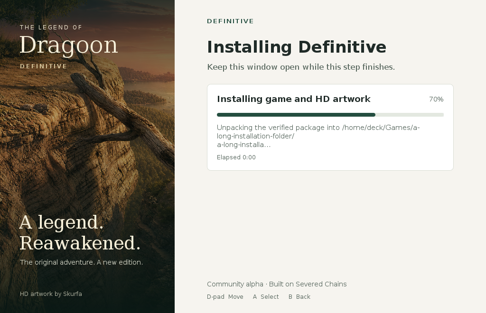
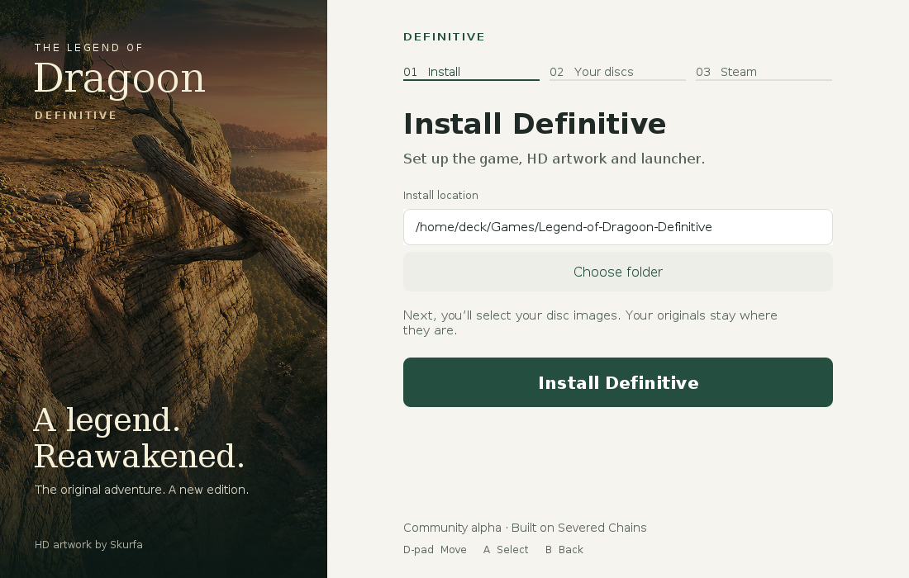
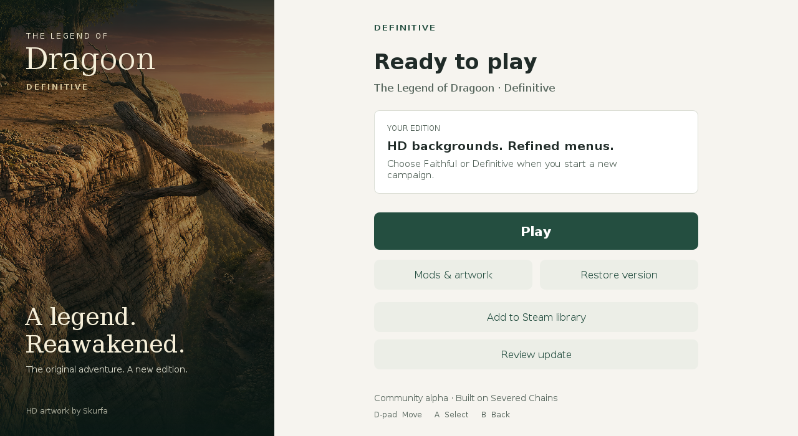
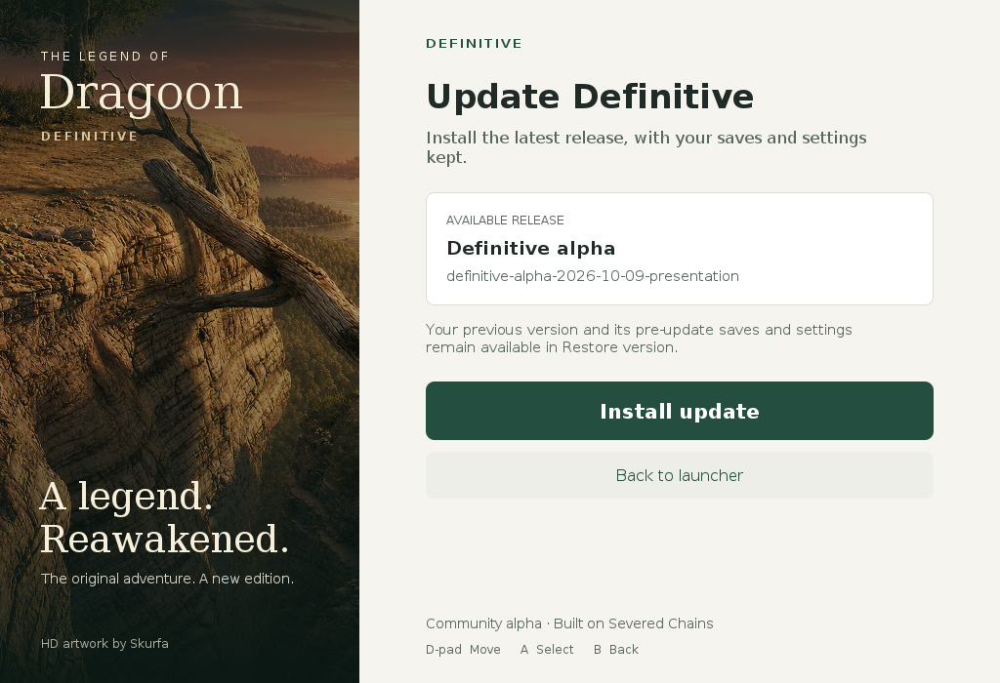
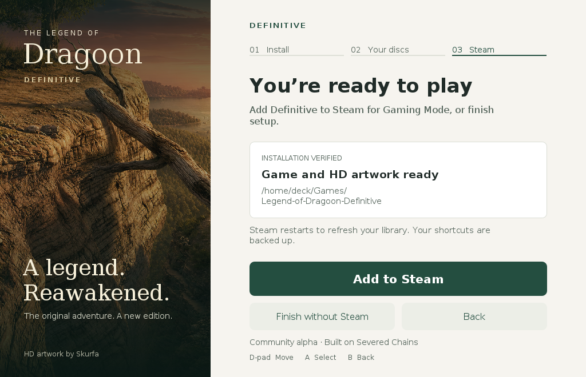

# Installer, launcher and updater refinement

## Recovery and copy refinement

Error screens now explicitly focus the visible recovery action after replacing the working screen. A new isolated-window regression checks recovery focus, controller movement to error details, and the Back action. The local headless run defers this window case to Linux CI; it does not operate the owner's desktop.

The remaining Steam race-guard messages direct the user to retry **Add to Steam**, which performs the graceful exit, verified shortcut edit and restart automatically. The existing guards still refuse to write while Steam is running or when its library changes during setup.

The updater shows a readable release date and edition, with the full identifier retained in its tooltip and accessible description. Its opening copy now states directly that saves and settings stay in place. Long tokens wrap using font measurements and complete Unicode characters, with useful path boundaries and no isolated trailing letter. Installer, launcher and update screens are checked at the minimum 1024 × 660 client area. Wide Latin and Unicode folder names have additional presentation regressions.

The launcher reserves at least 12 pixels between its last action and footer at the minimum size. Secondary-action spacing is adjusted to retain the same large controls and aligned form column. A rendered-layout regression checks this separation with an update available.

The first supported local Java 25 build and headless delivery suite passed: 88 cases, 85 passed, zero failures, three isolated-window cases deferred. The first hosted Linux build then caught clipping in the wide-folder regression. Publication was held. The verified-location card now uses a bounded middle summary, with the complete path retained in its tooltip and accessible description. Failure output includes full assertions, and CI retains reports even when a build fails. The corrected package and isolated-window checks must pass before publication. Physical Steam Deck touch, controller and real Steam acceptance remain open; these checks do not establish commercial release readiness.

## Controller focus refinement

The shared actions now use a pale pine outline on primary buttons and a dark pine outline on secondary buttons. Focus remains clear through normal, hover and pressed states. The installation path uses the same dark outline when focused, with unchanged text insets and alignment. Disabled controls do not display an active focus ring.

Headless regressions paint the actual shipped controls with an isolated focus manager. Before the correction, secondary-button focus measured 2.104:1 against its fill and failed the 3:1 check. The installation field also lacked a distinct focus state. Both regressions pass after the correction; installer, launcher, updater, error and restore layout renders were inspected again. These checks measure rendered focus contrast and layout, not physical Deck controller behavior or commercial release readiness. Steam still performs its graceful shutdown, backed-up shortcut edit, verification and restart automatically.

Source [`35d155cf43e5e5ab3ec088b4f34f848ef8b1ef34`](https://github.com/gideonidoru/legend-of-dragoon-definitive/commit/35d155cf43e5e5ab3ec088b4f34f848ef8b1ef34) passed all three jobs in [hosted run 38039109695](https://github.com/gideonidoru/legend-of-dragoon-definitive/actions/runs/38039109695). Linux and Mac each reported 84 delivery cases: 82 passed, zero failures, two deferred; Linux separately passed both actual-window cases under Xvfb. The normal/hover/pressed focus renders measure at least 5.03:1 on primary actions, 7.22:1 on secondary actions and 9.38:1 on the focused installation field. Bootstrap, recovery, archive, publication and material checks passed. Both downloaded packages passed their complete inventories, source/tag/platform and hash checks: Linux `alpha-052d4a10aefeb953`, Mac `alpha-166448d25adbed32`. Their portable interfaces are byte-identical. Linux setup, Steam, launcher, update and focus renders were inspected.

The [controller focus refinement](https://github.com/gideonidoru/legend-of-dragoon-definitive/releases/tag/definitive-alpha-2026-10-10-refinement-2) is public after the account, exact-source build, tag and complete-upload checksum gate passed. Independently downloaded public entry points match the checked upload bytes. [SHA256SUMS](https://github.com/gideonidoru/legend-of-dragoon-definitive/releases/download/definitive-alpha-2026-10-10-refinement-2/SHA256SUMS) records the five download digests. This release updates presentation; private character/model experiments are not included.

A fresh isolated installation using the exact-source hosted manager selected this public release, downloaded and verified its Mac package, created the installation/data directories, installed the HD mod and wrote verified executable launchers. The probe exited successfully. It did not prepare discs, launch gameplay or operate real Steam. Local stamped-entry checks also passed URL/checksum parsing, visible download failures, phase progress, startup/storage failures and lock cleanup.

## October 10 progress refinement

A follow-up review reproduced clipped progress detail when an installation path exceeded the progress card's fixed text height. The regression rendered the actual Swing components at the minimum 1024 × 660 client area and failed on clipped wrapped copy. Work detail now has a bounded, Unicode-safe summary; the full detail is retained in the tooltip and accessible description. The elapsed timer has its own line, so its updates do not reflow the work description. Existing phase names, completed-work percentages and operation logs remain in use.

The presentation checks now measure plain-label text against its actual available width, in addition to checking component bounds and wrapped-copy height. The long-detail case covers 1024, 1100 and 1280-pixel widths. Installer, launcher, update review, update completion, restore and error layouts remain covered. Steam integration still performs a graceful close, backed-up shortcut write, verification and restart; blocked shutdown and failed restart produce an error rather than success.

The local Corretto 25 / Gradle 9.1.0 build and focused presentation, installer-flow and Steam lifecycle suites passed on the Mac Studio without operating real Steam or opening desktop windows. The hosted package and physical Deck acceptance are separate checks; this correction does not establish commercial release readiness or a reliability guarantee.

Source [`45f71cb70ab28f6f9badde6350b4d70c7daecaab`](https://github.com/gideonidoru/legend-of-dragoon-definitive/commit/45f71cb70ab28f6f9badde6350b4d70c7daecaab) passed all three jobs in [hosted run 38032117393](https://github.com/gideonidoru/legend-of-dragoon-definitive/actions/runs/38032117393). Linux and Mac each reported 78 delivery cases: 76 passed, zero failures, two deferred. Linux separately passed both actual-window tests under Xvfb. Bootstrap failure/recovery, native archive, publication and material interoperability checks passed. Both downloaded platform packages independently passed their complete closed inventory, source, platform, release-tag and hash checks: Linux `alpha-abd4cf4fb613982f`, Mac `alpha-b87c5990b18c72b8`. Both hosted portable interfaces match the locally reviewed build byte-for-byte. The local test-control script's first attempt lacked a Java environment; with Corretto 25 explicitly selected, all seven scenarios passed.

The Linux setup, Steam, launcher, update-review and long-progress renders were visually inspected. The progress example below is a synthetic long-path stress case rendered by the actual shipped components, rather than a physical Deck capture.

The [October 10 installer correction](https://github.com/gideonidoru/legend-of-dragoon-definitive/releases/tag/definitive-alpha-2026-10-10-refinement) passed the publication gate and is public. The gate verified the account, exact source/build correlation, release tag, complete asset set, uploaded sizes and SHA256 digests. Independently downloaded public desktop and shell entry points match the checked upload bytes. A fresh isolated installation using the exact-source hosted manager selected this release, downloaded and verified the full Mac package, created the installation/data folders, installed the HD mod and wrote verified executable launchers. Disc preparation, gameplay and real Steam were not run in that fresh probe. Public [SHA256SUMS](https://github.com/gideonidoru/legend-of-dragoon-definitive/releases/download/definitive-alpha-2026-10-10-refinement/SHA256SUMS) records all five download digests.

| Entry | Bytes | SHA256 |
| --- | ---: | --- |
| `Install-Definitive.desktop` | 1,380 | `c4540e07a7574280e5af65aa0a4a81eaf1ef24d98d2601804ff0e5b586d9f129` |
| `Install-Definitive.sh` | 3,436 | `995de4f705b4d9dd7dcbec88058aec95cfd468402aaab90da4af0d69dadfeb57` |
| `Definitive-Installer.zip` | 9,375,275 | `819c6b7b4468adae6a7691f4758bc6f39711f1c3446d7068b4949f0c7af950e9` |

The presentation milestone follows the owner's October 9 request for restrained, polished, readable screens and automatic Steam integration. It changes the delivery UI and Steam lifecycle only; engine rendering and gameplay are unchanged.

## Presentation

The shared palette uses warm paper, pine, dark ink and white cards over existing Skurfa artwork. Forms are centered in a consistent 520-pixel column; the install path and actions align. The default remains `$HOME/Games/Legend-of-Dragoon-Definitive`. Text smoothing is applied consistently even when desktop font settings are absent. Body copy is shortened, secondary actions are paired, and long paths wrap at useful separators instead of leaving an isolated final letter. Touch targets remain 48–60 pixels.

The launcher keeps Play primary. Updates have an explicit review screen, real phase/size/count progress, a verified completion screen and a return to the launcher. Restore, account selection, file selection and error details share the presentation. Errors keep the complete log while bounding the main-screen summary. Selecting disc files dismisses the picker before preparation starts. Both verified finish paths dispose the installer.

## Steam integration

Clicking Add to Steam authorizes the installer to request a graceful exit, wait for all owned Steam processes to stop, back up and atomically edit the selected account's shortcut file, reread and verify exactly one matching launcher, then restart Steam. Progress names each phase. The integration lock spans accounts in the same Steam userdata directory, preventing overlapping installers from closing or restarting each other's client. Existing library-write guards remain active. No client is force-killed.

Shutdown failure leaves the library untouched. Edit failure attempts to reopen a previously running client. Restart failure retains the verified shortcut, shows the actual error and permits an idempotent retry; it cannot report success. Client output is retained in the installation's `steam-integration.log`. A process-start check establishes that the client began running, not that its UI loaded or the shortcut appeared in Gaming Mode.

## Evidence and acceptance

Headless tests render the actual shipped components on macOS and Linux; they do not open the owner's desktop. Setup layouts are checked at widths 1024/1100/1280 and client heights 660/700/760, including every visible control, wrapped copy and ancestor clipping. Launcher/update/error/restore views have additional checks. Rendered PNGs are retained with hosted build artifacts. Linux also tests the actual disc picker and installer window under an isolated virtual display.

Steam lifecycle tests use separate synthetic libraries and client stand-ins. They cover close/write/start ordering, exactly-one verification, repeat addition, blocked or failed shutdown, corrupted libraries, restart failures/timeouts, concurrent integration and direct shutdown arguments/logging. They do not shut down or start the owner's Steam.

Physical Deck acceptance remains required: the graceful Steam command and restart on stock SteamOS, account choice, Gaming Mode visibility, both finish paths, touch/controller focus across the restart, reconnect, offline use and update recovery. Passing compilation, rendered fixtures or lifecycle tests does not establish commercial release readiness or a reliability guarantee. Follow [the Deck protocol](DECK_TEST_PLAN.md).

The initial full local Mac build used Corretto 25 and Gradle 9.1.0 with `build definitivePackage portableInstaller -PreleaseTag=definitive-alpha-2026-10-09-presentation`. Its delivery suite reported 62 cases: 61 passed, zero failures, one actual-window case deferred to Linux. The full supported build succeeded after both independent reviews and their recovery/wrapping corrections. Native archive imports, bootstrap download/failure handling, eight lock/interruption cases, sixteen publication-gate cases and workflow lint passed. Mac setup, launcher, update, progress, error and restore renders were inspected. Hosted source/package evidence and Linux visual acceptance are recorded after the exact committed build finishes.

The first hosted Linux render exposed unsmoothed text despite passing layout tests. Shared surfaces now explicitly apply grayscale text smoothing; a black-on-white text fixture requires intermediate edge coverage. This presentation correction is checked by a new exact-source hosted build before publication.

The smoothing correction passed all 63 local delivery cases: 62 passed, zero failures, one window case deferred. It rebuilt the portable installer without opening desktop windows. Both independent focused reviews found no remaining actionable defect in the correction.

The smooth roots are Swing painting origins, so selection, focus and changing progress labels retain smoothing during dirty-child repaints. Linux's actual-window suite now checks immediate opaque-child repaint routing through both roots, as well as picker disposal and Finish. These two tests remain skipped in local headless runs and execute only in the CI virtual display.

## Initial presentation build inputs

Final build source: [`d48a133bcb19f38d68a7803b7beca3a42d059a1f`](https://github.com/gideonidoru/legend-of-dragoon-definitive/commit/d48a133bcb19f38d68a7803b7beca3a42d059a1f). [Hosted run 38017506402](https://github.com/gideonidoru/legend-of-dragoon-definitive/actions/runs/38017506402) passed all three required jobs using Temurin 25 and Gradle 9.1.0. Linux and Mac each passed 62 delivery checks, zero failures, with two window checks deferred. Linux separately passed both actual-window checks under Xvfb, including dirty-child repaint smoothing. All bootstrap, lock, archive, publication and cross-language material checks passed. The first render build, 38016964109, was held from publication because its Linux text edges were visibly rough.

Both downloaded platform packages passed their full closed inventories, hashes, source/platform/tag and package identity checks: Linux `alpha-bce0ae3ac7a76f20`, Mac `alpha-3cc5d29317c7e49d`. Both hosted portable archives match each other and the locally stamped entry point byte-for-byte. The Mac hosted package upgraded an isolated QA installation and prepared the owner's previously imported four discs with the real upstream extractor in about 11 seconds. This retained its fixture shortcut and verified launchers/data; it did not open the game or operate the real Steam library.

| Asset | Bytes | SHA256 |
| --- | ---: | --- |
| `Install-Definitive.desktop` | 1,382 | `48d124621a8aa7052a3dab91ecc90eed5a0c704a0867ab1885499ad9d030c4f5` |
| `Install-Definitive.sh` | 3,438 | `342754a4816d4efce89d117d52a1fd22caa78421190e0de053b0f11c1932202a` |
| `Definitive-Installer.zip` | 9,373,315 | `483c02991d5cf2c551f58eebcc3bf18bd5d5e6e390eac9556b9063e0ef40d900` |
| `Legend-of-Dragoon-Definitive-linux-x64.zip` | 433,349,448 | `4d9a6eb4808c2aa0e8f4783d3dc023ef7563c8db0ca5347143fbbe143ae1ea4f` |
| `Legend-of-Dragoon-Definitive-macos-arm64.zip` | 423,792,738 | `c1c5008e4dedc9ac258b53c72f48c5a03388779d87cd52b2561bf6c6833cfa83` |

## Linux screen review

These are the actual shipped Swing components rendered in corrected hosted run 38019004372, rather than a separate mockup or a physical Deck capture. Skurfa artwork and its source/license attribution remain intact. Setup and launcher examples are 1100/1280 by 700 pixels; the smallest tested client area is 1024 by 660.

## Public release-selection correction

The first live public setup probe completed a verified installation, but its source assertion failed: the actual GitHub release index listed the earlier recovery build ahead of the newer presentation build. Repeating the fresh probe confirmed the same result. The installer and updater had trusted list order, so the initial presentation build is superseded by a correction rather than replacing its immutable assets.

Selection now compares publication times of compatible, non-draft releases, validates the selected metadata and tag-bound URL, then checks the installed identity. An older installed release cannot hide a newer update, and an already-current installation cannot be offered an older listed entry. Invalid publication dates, ambiguous newest dates and wrong tag download URLs fail closed, including when the selected identity matches the installed release. Equal dates among older releases do not hide a uniquely newer release. The corrected published release must pass a fresh live source-identity assertion before delivery is considered verified.

The correction's full local supported build passed with `build definitivePackage portableInstaller -PreleaseTag=definitive-alpha-2026-10-09-presentation-2`: 71 delivery cases, 69 passed, zero failures, two actual-window cases deferred to Linux. All bootstrap, interruption, archive, publication-gate and workflow checks passed again. Both independent focused reviews found no remaining actionable finding.

## Corrected package verification

Source: [`53d4106453f391c52e0953d488df424170f4d89b`](https://github.com/gideonidoru/legend-of-dragoon-definitive/commit/53d4106453f391c52e0953d488df424170f4d89b). [Hosted run 38019004372](https://github.com/gideonidoru/legend-of-dragoon-definitive/actions/runs/38019004372) passed all three required jobs. Linux and Mac each reported 71 delivery cases: 69 passed, zero failures, two deferred; Linux separately passed both actual-window checks under Xvfb. All workflow bootstrap, interruption, archive, publication and material checks passed.

Both independently downloaded packages passed full closed inventory, identity, source, tag and platform checks: Linux `alpha-f00dc5f81588f473`, Mac `alpha-63a4e65b5f20df7c`. Both portable installers are byte-identical to each other and the locally stamped entry point. The exact-source Mac package updated the isolated QA installation, prepared all four images through the real upstream extractor in about 11 seconds, and retained its verified fixture shortcut. It did not operate real Steam or launch gameplay.

| Asset | Bytes | SHA256 |
| --- | ---: | --- |
| `Install-Definitive.desktop` | 1,384 | `d74ecf35d5b8ae47aa6cb3226d32b30a215649a93516ac6cc2ebb1e4b5a4961b` |
| `Install-Definitive.sh` | 3,440 | `9014420767d97636d050d8f5c74100b6ff89f6b0aab5974aae15e6efcfe693c9` |
| `Definitive-Installer.zip` | 9,374,950 | `280ca1b049b372365c72924942604f39e746fdbf6da372269710dd1fe9e5e42b` |
| `Legend-of-Dragoon-Definitive-linux-x64.zip` | 433,352,635 | `7e989ff91c8ae9ddc6bec0f5c4d53fa048ff2dea1bc91a70286d7eb8abed80f0` |
| `Legend-of-Dragoon-Definitive-macos-arm64.zip` | 423,795,925 | `6ebb6e6893a42e545a3a32a1dc78f701c85e27cac86df65ec25ef8adb9cfa268` |

## Published delivery check

The [corrected alpha](https://github.com/gideonidoru/legend-of-dragoon-definitive/releases/tag/definitive-alpha-2026-10-09-presentation-2) was published only after the account/build/tag/complete-asset gate passed. Independently downloaded public desktop and shell entry points match the upload inputs byte-for-byte with normal TLS verification.

Using the manager from the exact-source hosted package, a fresh public installation at the isolated `network-presentation-2-oct09` QA root downloaded and verified the expected source, tag, asset identity, full inventory, HD mod and executable launchers. It exited successfully. A separate earlier recovery installation completed a live public update to the same corrected source, preserved synthetic save data, suppressed an update when current, then restored and verified the previous engine/data. Its restored installation rediscovered the newer correction. That probe also exited successfully. These checks did not launch the game or real Steam.

The release index still places the older recovery entry first; the corrected selector handles this real response correctly. Earlier clients can retain the old selection bug. Redownload the corrected `.desktop` entry and select the existing installation folder for repair/upgrade. Previous immutable assets are preserved; superseded release notes direct users to the corrected installer.

Remaining acceptance is on physical Steam Deck hardware using [DECK_TEST_PLAN.md](DECK_TEST_PLAN.md): real Steam lifecycle/Gaming Mode, touch/controller interaction, installation/upgrade/restore under interruption and offline launch. These delivery checks do not establish gameplay performance or the planned character-rendering improvements.
