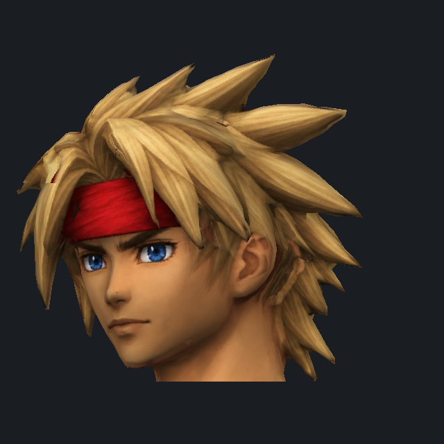

# Dart reference · reconstructed head and materials

**Experimental. Owner approval is required before main, release or normal installation.**

A working Dart field/battle model set: a reconstructed head, connected volumetric blond hair, ears and jaw, a painted 2048 × 2048 face/hair/bandana texture, and the previously improved ModelsHD body. The current production CharHD body atlas composes with the new head in the battle renderer. The full body has not yet received a bespoke AA reconstruction.

[Editable fitted head GLB](dart-head-aa-v1.glb) · [2K texture](../resources/charhd-experiment/reconstruction/dart-head-aa-v1.png) · [validation](VALIDATION.md) · [asset hashes](asset-inventory.json)



This is a render of the actual fitted custom mesh and texture. It is a studio view, not a game screenshot. The image-generation inputs below are authoring inputs and are not runtime proof.

## Asset set

`models/parts` contains twelve custom override packs: ten unchanged body packs from the preferred experiment and two new head packs. The fitted head has 5,748 triangles and 5,211 vertices after removing the extra generated neck. Total actor geometry is 7,202 field triangles and 8,408 battle triangles. The original rigid head pivot, animation hierarchy, native CPU tables and attachment/indexed-effect controls remain in place.

The editable GLB contains the fitted custom field head only, with an embedded diffuse material. Its axes are +X forward / +Z up, in native field units. The battle pack is the matching transformed head on the original battle pivot; the GLB is not a replacement skeleton or a full-body rig.

The UV bindings live in `../resources/charhd-experiment/reconstruction`. They require the exact source-part identity, prepared geometry identity, vertex count and texture checksum. The supplemental head texture uses its own sampler; it does not replace the body atlas. Unknown geometry, existing appearance replacements and native-index deformation retain their established routes.

## Isolated developer trial

Build this experimental branch with Java 25 and the supported Gradle wrapper. Game files must remain in a separate local installation. Do not run the trial in a normal installed game.

```sh
./gradlew -I experiments/dart-modelshd-charhd/experiment.init.gradle \
  dartExperimentTests modelsHdTests charHdTests dartExperimentJar charhdJar
```

The opt-in JAR is `build/dart-experiment/CharHD-Dart-EXPERIMENT-NOT-APPROVED.jar`. In an isolated runtime of this branch, enable ModelsHD, production CharHD and that experimental JAR; copy this directory's twelve packs into `model-packs/modelshd/parts`. The branch engine is required because it contains the gated appearance extension. Do not mix its experimental JAR with a released engine. No normal installer or release selects these overrides.

Removing the isolated experimental JAR and its twelve overrides returns the normal model route. This directory does not contain game files, original full actor controls, saves, weights or local runtimes.

## Authoring

Custom source art was made with native image generation/editing. `dart-head-source-v1.png` establishes Dart's blond spikes, red bandana, blue eyes and youthful design. `dart-material-views-v1.png` supplies front/side/rear paint on the reconstructed mesh. `dart-opposite-material-v1.png` supplies opposite-side hair cleanup; its exact edit prompt is in `opposite-material-prompt.txt`. Only hair is transferred during that final cleanup, retaining the established face and bandana.

A pinned local MIT TripoSR pipeline reconstructs the volume on CPU. No neural inference or weights ship to Steam Deck. Supplier revision: `107cefdc244c39106fa830359024f6a2f1c78871`; weights SHA-256: `429e2c6b22a0923967459de24d67f05962b235f79cde6b032aa7ed2ffcd970ee`. See [TRIPOSR-LICENSE.txt](TRIPOSR-LICENSE.txt). Tooling and weights are external authoring prerequisites.

1. `reconstruct-and-bake.py`: verify pinned offline tooling, reconstruct at 256 resolution, simplify, smooth with pinned boundaries, unwrap and project custom art onto a 2K UV bake.
2. `bake-material-views.py`: transfer custom paint using normal weighting and depth visibility; reject neutral background spill, pad UV edges and verify that geometry/UVs/normals were preserved.
3. `fit-native-head.py`: fit and clip the extra neck, retain native winding, build custom source-lineage packs and exact UV bindings. Original full actor controls are emitted only to a new private external study.
4. `export-native-head.py`: export the fitted custom field head as an editable GLB without requiring game files.
5. `render-native-comparison.py`: compare actual fitted packs and UVs under matched studio lighting. It requires local originals for the control and emits only to a new private review directory.

The receipts record source/tool/weight/art hashes and fit parameters. Their `experimental-not-approved` status is intentional.

## Quality and next work

The head is a substantial visual change, but the crown/rear clump topology still needs authored cleanup. Armor, fingers, boots, cloth volumes and sword detail remain from the previous body pass and CharHD. This is not a completed 2026 AA full character.

Next: rebuild the body surfaces while retaining each native part and joint boundary, author a matching material set, test battle attacks/field actions and texture overrides, then profile multiple actors on a physical Deck. Use Dart to settle the pipeline and visual direction before propagating it to the other party characters. Owner visual approval remains separate from passing builds or short game trials.

Custom scripts, geometry and textures follow the project's AGPL v3 terms. Preserve upstream and supplier notices. Dart and The Legend of Dragoon belong to their original owners; this is an unofficial fan project.
